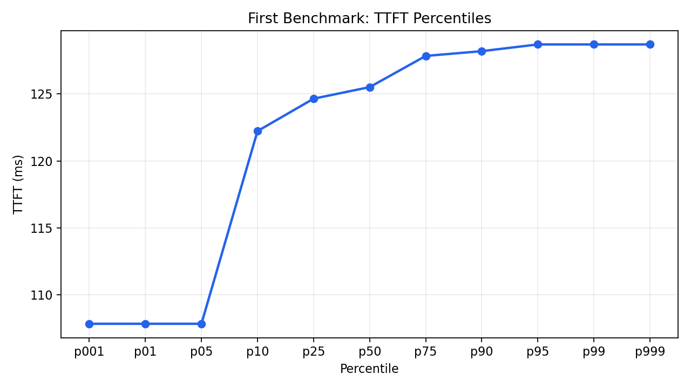
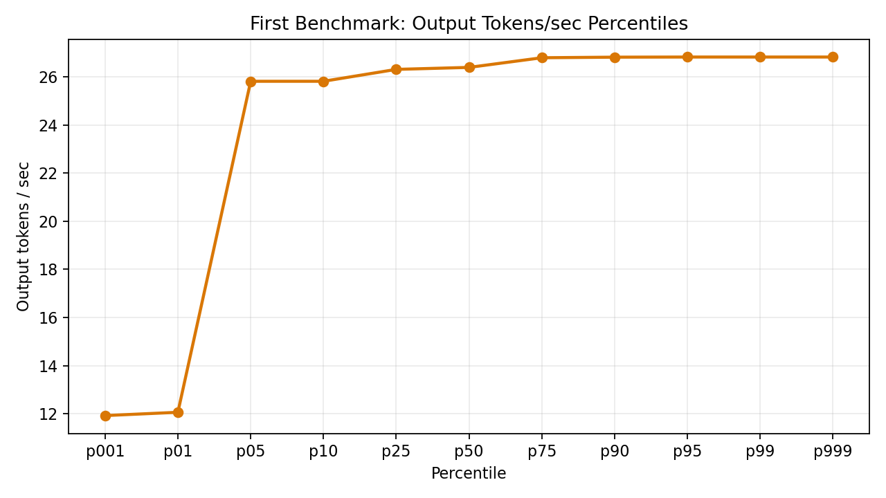

# Watchdog

vLLM Performance Regression Benchmarking Framework

## Motivation

Performance regressions in LLM systems are silent failures.

The system continues to function, but latency increases, throughput drops, and cost rises. These issues are not caught by correctness tests and are easy to miss without structured benchmarking.

The goal is to make performance changes visible and reproducible.

## Approach

GuideLLM is used to generate controlled workloads against a running vLLM server.

Each run varies:
- prompt length
- output length
- concurrency

Benchmarks are executed across scenarios (chat, code, summarize), with results exported as JSON.

Key metrics:
- Time to First Token (TTFT)
- Tokens per second (TPS)
- Requests per second (throughput)

By keeping model, hardware, and workload fixed, differences reflect configuration changes.

## What is implemented

- Automated GuideLLM benchmark runs
- Scenario-based workloads (chat, code, summarize)
- Concurrency sweeps
- JSON result outputs
- Scripted execution (`run_guidellm_qwen.sh`)

This provides a consistent baseline for comparing configurations.

## What is demonstrated

Performance regression detection is demonstrated manually by:

- running a baseline benchmark
- modifying a configuration (e.g., batching, quantization)
- rerunning the same workload
- comparing TTFT distributions and throughput

This shows how regressions can be identified using the generated data.

## What is not yet implemented

- Automated regression detection (threshold comparison)
- Prometheus metrics export
- CI/CD integration
- Automated root-cause analysis

## Baseline Performance (Qwen3-8B)

The plots below show baseline performance under a controlled workload  
(chat, 128 prompt / 128 output tokens, concurrency sweep).

These curves serve as a reference for comparing future runs and identifying regressions.

### TTFT Distribution



Shows latency distribution across requests. Tail behavior (p95–p99) is key for detecting regressions.

### Throughput Distribution



Shows decoding throughput under load. Shifts indicate efficiency changes.

## Example Results (Quantized FP8)

Using `RedHatAI/Qwen3-8B-FP8-dynamic`:

Chat (128/128):
- ~7.5 req/s @ concurrency 32
- ~974 output tok/s
- ~850 ms TTFT

Code (512/1024):
- ~0.3 req/s @ concurrency 8
- ~254 output tok/s
- ~781 ms TTFT

Higher concurrency increases throughput while increasing latency.

## How to run

Start a vLLM server, then:

```bash
export VLLM_BASE_URL="http://localhost:8000"
export MODEL_NAME="RedHatAI/Qwen3-8B-FP8-dynamic"
bash ./run_guidellm_qwen.sh
